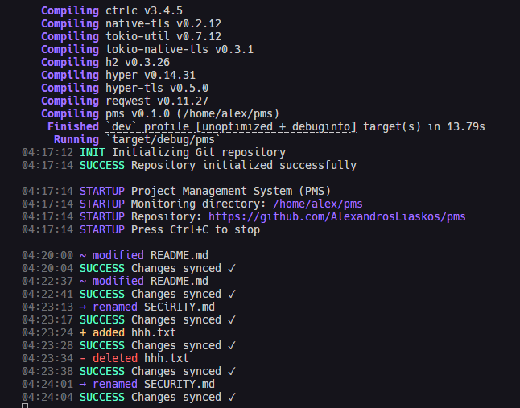

# PMS (Project Management System)

PMS is a file monitoring system with integrated Git version control. It automatically watches your project directory and synchronizes changes with GitHub in real-time.

## Installation

### Prerequisites

1. **Rust Environment**
   ```bash
   curl --proto '=https' --tlsv1.2 -sSf https://sh.rustup.rs | sh
   source $HOME/.cargo/env
   rustc --version  # Must be 1.56 or later
   ```

2. **Git Setup**
   ```bash
   git --version  # Must be 2.0 or later
   git config --global user.name "Your Name"
   git config --global user.email "your.email@example.com"
   ```

3. **GitHub Token**
   - Generate a Personal Access Token at https://github.com/settings/tokens
   - Token must start with `ghp_` or `github_pat_`
   - Required scopes: `repo`, `workflow`

### Building from Source

```bash
# Clone the repository
git clone https://github.com/yourusername/pms.git
cd pms

# Build in release mode
cargo build --release

# Install the binary
cargo install --path .

## Usage

The program monitors a specified directory and automatically syncs changes to GitHub:

```bash
# Start monitoring the current directory
pms

# Monitor a specific directory
pms /path/to/your/project
```

### What to Expect



When you run PMS, you'll see output like this:

```
04:17:14 INIT Initializing Git repository
04:17:14 SUCCESS Repository initialized successfully
04:17:14 STARTUP Project Management System (PMS)
04:17:14 STARTUP Monitoring directory: /home/alex/pms
04:17:14 STARTUP Repository: https://github.com/username/pms
04:17:14 STARTUP Press Ctrl+C to stop
```

As you make changes to files, you'll see real-time status updates:
```
04:20:00 ~ modified README.md
04:20:04 SUCCESS Changes synced ✓
04:22:37 ~ modified README.md
04:22:41 SUCCESS Changes synced ✓
04:23:13 → renamed SECURITY.md
04:23:17 SUCCESS Changes synced ✓
04:23:28 + added hhh.txt
04:23:38 SUCCESS Changes synced ✓
04:24:01 → renamed SECURITY.md
04:24:04 SUCCESS Changes synced ✓
```

File status indicators:
- `+` Yellow: File added
- `~` Blue: File modified
- `→` Bright Blue: File renamed
- `-` Red: File deleted

To stop monitoring, press `Ctrl+C`. The system will:
1. Sync any pending changes
2. Clean up resources
3. Exit gracefully

## Project Structure

After starting PMS:
```
your-project/
├── .pms/
│   ├── pms.log          # JSON-formatted logs
│   ├── monitor_active   # Status indicator
│   └── config.toml      # Project-specific settings
└── ... your files ...
```

## Troubleshooting

### Common Error Messages

1. **Configuration Errors**
   ```
   ERROR Failed to read config: Config file not found
   ```
   Solution: Create config file at `~/.config/pms/config.toml`

2. **Token Errors**
   ```
   ERROR Invalid GitHub token format
   ```
   Solution: Ensure token starts with `ghp_` or `github_pat_`

3. **Path Errors**
   ```
   ERROR Cannot monitor system directories
   ```
   Solution: Choose a non-system project directory

4. **Git Errors**
   ```
   ERROR Failed to push changes
   ```
   Solution: Check GitHub token permissions and network connection

### Logs

Check detailed logs at:
```bash
cat .pms/pms.log
```

Logs include:
- Timestamped events
- File changes
- Git operations
- Error details

## Support

If you encounter issues:

1. Check the logs:
   ```bash
   cat .pms/pms.log
   ```

2. Submit an issue with:
   - Full error message
   - Log contents
   - OS version
   - Rust version (`rustc --version`)
   - Git version (`git --version`)
   - Steps to reproduce

## License

This project is licensed under the MIT License - see the [LICENSE](LICENSE) file for details.
